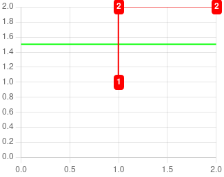

# ChartsHTML

This is a PoC for a Chart.js HTML binding.<br/>
This is based on the [LISS WebComponent library](https://github.com/denis-migdal/LISS).

```html
<chart-html>
    <chart-value name="val">1.5</chart-value>
    <chart-tooltip>`Title ${v.val}`</chart-tooltip>
    <chart-datalabels></chart-datalabels>

    <chart-scale name="x" min="0" max="2"></chart-scale>
    <chart-scale name="y" min="0" max="2"></chart-scale>

    <curve-line name="curve" tooltip="`${c.name}: (${c.x}, ${c.y})`" color="red">
        [[1,1],[1,2],[2,2]]
    </curve-line>
    <curve-hline color="#00FF00">v.val</curve-hline>
</chart-html>
```

<center>
    
</center>

ChartsHTML uses **composition** in order to **factorize** code, improving readability and facilitating graph creation. It uses WebComponents enabling to easily see and modify on the fly the graph configuration through the browser developer tools. It also favors extensibility and reusability. A JS API (<mark>TBI</mark>) will also be provided.

ChartsHTML also integrates several ChartsJS plugins :
- Zoom (<mark>TBI</mark>)
- Datalabel
- C2S (<mark>TBI</mark>)

As well as providing new features :
- data sources synchronisation.
- data exports (csv, json) (<mark>TBI</mark>).
- graph exports (png, svg, HTML) (<mark>TBI</mark>).

## Graph

```html
<chart-html>
    <!-- chart values/options -->
    <!-- chart content -->
</chart-html>
```

### Attributes

- "measure-render-time"

### Children

- Dataset
- Scale
- Zoom
- Tooltip
- Datalabel
- Value

### Public API

- `setValue`
- `getValue`
- `evalContext`

- `getDataset`
- `toCSV()`

- `updateAll` : when a value changed (update all components)
- `update` : when a component changed

- `.zoom` : cf Zoom

- `insertDataset` : called by dataset component.
- `_chartJS`

### Protected API

## Components

### Attributes

- name

### Public API

- `chart`
- `update` : recompute parsed content. Called when values are updated.
- `contentParsed`

### Protected API

- `_contentParser` : how to parse content.
- `_insert` : how to insert the component.
- `_update` : how to update the component.
- `_before_chart_update` : when a component value depends on the graph e.g. scales/zoom min/max.

### Internal API

- `_attach` : called by the graph to attach the component.
- `_detach` : no effects yet.

## Dataset

```html
<chart-scale name="curve" type="scatter">
    [[0,0],[1,1]]
</chart-scale>
```

### Attributes

- type : cf ChartJS
- color
- tooltip : cf `<chart-tooltip>`

### Inherited

- `<curve-line>[[1,1],[1,2]]</curve-line>`
    - attrs : showPoints="false"
- `<curve-hline>1.5</curve-hline>`
- `<curve-vline>1.5</curve-vline>`

### Public API

- `dataset` : ChartJS dataset.
- `tooltip` : cf `<chart-tooltip>`
- `getDatalabel` : cf `<chart-datalabels>`.
- `datalabelToggle` : cf `<chart-datalabels>`
- `toCSV()`

### Protected API

- `additionalContext` : cf values.

## Scale

```html
<chart-scale name="y" min="0" max="2"></chart-scale>
<chart-scale name="x">A,B,C</chart-scale>
```

### Attributes

- name : starts with x or y
- position : top/bottom/left/right
- min
- max

### Public API

### Protected API

## Zoom

```html
<chart-zoom direction="x"></chart-zoom>
```

### Attributes

- direction : x | y | xy | none

### Public API

- `reset()`

### Protected API

## Value

```html
<chart-value name="val">1.5</chart-value>
```

### Known values

- x
- y
- name

### Public API

### Protected API

## Tooltip

```html
<chart-tooltip>Title ${val}</chart-tooltip>
```

### Attributes

- direction : x | y

Call datasets' `.tooltip()`.

### Public API

### Protected API

## Datalabel

```html
<chart-datalabels></chart-datalabels>
```

Call datasets' `datalabelToggle()` and `getDatalabel()`.

### Public API

### Protected API

## OPTI

- show-points="false"
    - 100,000 points : 300ms -> 10ms.

## TODO

- [ ] Datalabel : add/remove labels + default label
- [ ] Udpate freq : setAnimationFrameRequest + attached/detached visibility.
- [ ] obs content in parent
- [ ] Distinguish : internal vs protected vs public.
- [ ] Zoom : set axis limits
- [ ] JS API
    - [ ] : graph attach(component) [insert in DOM].